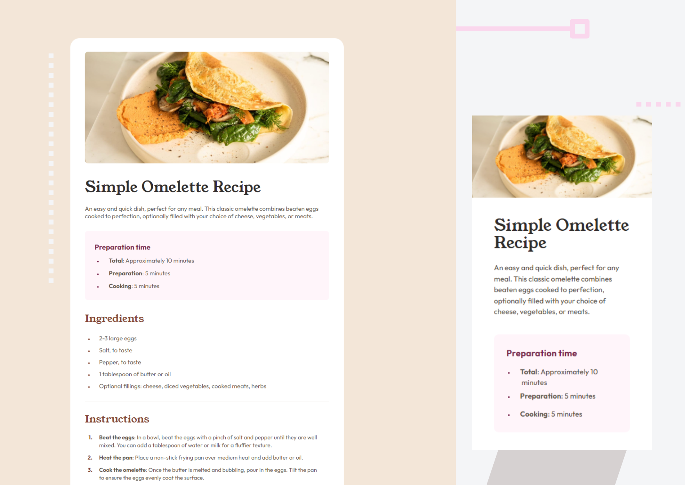
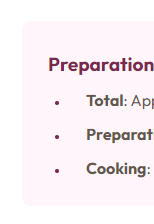
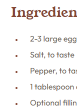

# Frontend Mentor - Recipe Page Solution

This is my solution to the [Recipe Page challenge](https://www.frontendmentor.io/challenges/recipe-page-KiTsR8QQKm). 
## Table of contents

- [Overview](#overview)
  - [The challenge](#the-challenge)
  - [How it looks](#how-it-looks)
  - [Links](#links)
- [My process](#my-process)
  - [Built with](#built-with)
  - [Highlight](#highlight)
  - [Useful resource](#useful-resource)
- [Author](#author)

## Overview

### The challenge

The project features an omelette recipe page built with a mobile-first approach.


### How it looks




### Links

- Solution URL: []()
- Live Site URL: [Recipe Page | Frontend Mentor Challenge Solution](https://saramouradev.github.io/recipe-page-challenge/)


## My process

### Built with

- HTML5 markup
- CSS custom properties
- Flexbox
- Mobile-first workflow


### Highlight

#### Pseudoelement

This challenge provided an opportunity to implement the ```marker``` pseudoelement to style list markers with different colors:

 




### Useful resource

- [Real Favicon Generator](https://realfavicongenerator.net) - This helped me to adapt favicons used in this project. I really liked this tool and recommend it.


## Author

- Frontend Mentor - [@SaraMouraDev](https://www.frontendmentor.io/profile/SaraMouraDev)
